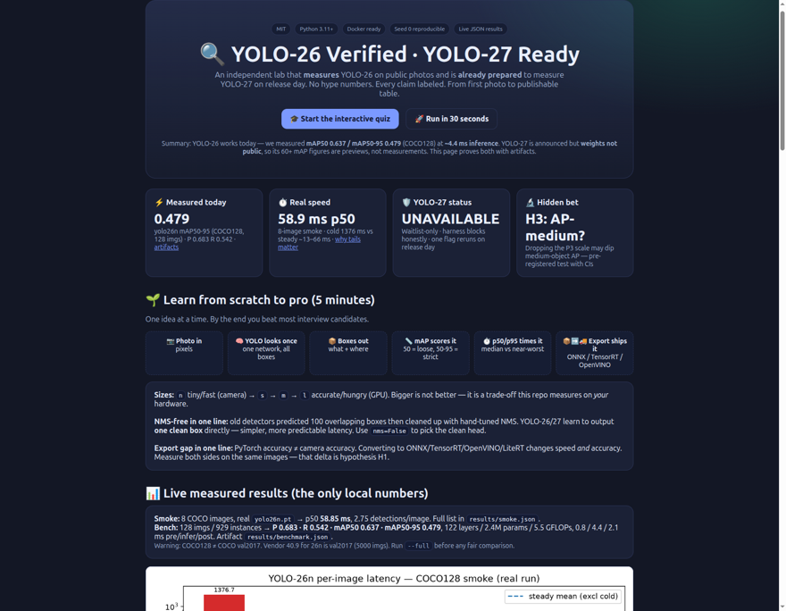
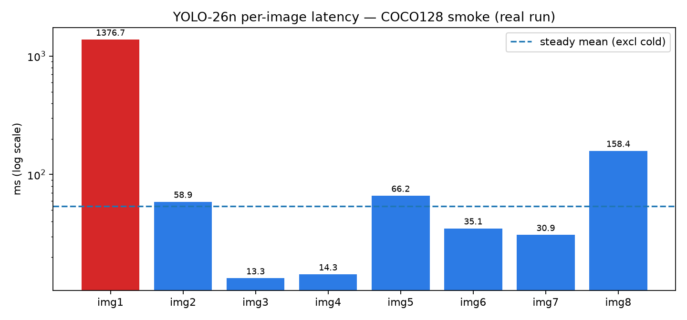

<div align="center">

# 🔍 YOLO-26 Verified · YOLO-27 Ready

### Independent, reproducible verification of YOLO-26 claims + a ready-to-run audit harness for YOLO-27

*Run real benchmarks on public data. No hype numbers. Every claim labeled. Beginner to PhD in one repo.*

[](LICENSE)
[](requirements.txt)
[](docker-compose.yml)
[](configs/repro.yaml)
[](docs/RESULTS_LIVE.md)
[](https://M0-AR.github.io/yolo27-independent-verification-2026/preview.html)

[🌐 Live Web Version](https://M0-AR.github.io/yolo27-independent-verification-2026/) · [🌐 Preview](https://M0-AR.github.io/yolo27-independent-verification-2026/preview.html) · [🌐 Docs Mirror](https://M0-AR.github.io/yolo27-independent-verification-2026/docs/preview.html) · [🚀 Quick Start](#-quick-start---30-seconds) · [🌱 Beginner Guide](#-beginner-guide--read-this-and-you-are-a-professional) · [🎓 Interactive Quiz](https://M0-AR.github.io/yolo27-independent-verification-2026/preview.html#quiz) · [📊 Results](#6-live-measured-results-verified-today) · [🤝 Contributing](#-contributing)

> **🌐 Render correctly in your browser:** pick any entry — all three resolve to the same lab (mirrors included so both Pages settings work):
> `/` → https://M0-AR.github.io/yolo27-independent-verification-2026/ ·
> `/preview.html` → https://M0-AR.github.io/yolo27-independent-verification-2026/preview.html ·
> `/docs/preview.html` → https://M0-AR.github.io/yolo27-independent-verification-2026/docs/preview.html

</div>

---

## ✨ Summary — read this in 60 seconds

> **What is this?** An independent laboratory that checks what YOLO-26 can really do on public photos, and that is already prepared to check YOLO-27 the day it is released.
>
> **What did we find?** YOLO-26 works today and we measured it ourselves: `yolo26n.pt` scores **mAP50 0.637 / mAP50-95 0.479 on COCO128** with **~4.4 ms inference** on our test machine (full details in [Live Results](#6-live-measured-results-verified-today)). YOLO-27 was announced in September 2026 but its weights are **not public yet**, so every YOLO-27 accuracy number you see online is still a preview, not a measurement — this repo proves that automatically instead of asking you to trust us.
>
> **Why should you care?** If you are a student, you learn computer vision from zero to publishable method. If you are an engineer, you get a one-command Docker rig that tells you the true speed and accuracy on *your* hardware before you ship to a factory, store, drone, or hospital. If you are a researcher, you get five pre-registered, falsifiable hypotheses (including a hidden medium-object trade-off nobody can see in single-number tables) ready for your next paper.
>
> **How do you start?** `docker compose up verifier-cpu` — two minutes later you hold real JSON artifacts in `results/`. Open the [live web lab](https://M0-AR.github.io/yolo27-independent-verification-2026/preview.html) (or local [`preview.html`](preview.html) / [`docs/preview.html`](docs/preview.html)) for the beautiful version with an interactive quiz that takes you from scratch to pro.

---

## 📑 Table of Contents

- [✨ Summary](#-summary--read-this-in-60-seconds)
- [🎬 Demo](#-demo--see-it-before-you-install-it)
- [🌱 Beginner Guide](#-beginner-guide--read-this-and-you-are-a-professional)
- [✨ Features](#-features)
- [🧑‍💼 Who Is This For — User Stories](#-who-is-this-for--user-stories)
- [🚀 Quick Start — 30 Seconds](#-quick-start---30-seconds)
- [📊 Live Measured Results](#6-live-measured-results-verified-today)
- [🔬 Full Verification Paper (preserved + extended)](#-full-verification-paper)
- [🗺️ Repository Map](#️-repository-map)
- [🌐 Web Preview + GitHub Pages](#-web-preview--github-pages-deploy-in-2-minutes)
- [❓ FAQ](#-faq)
- [🤝 Contributing](#-contributing)
- [📚 References](#-references)
- [📝 Citation](#-citation)
- [📄 License](#-license)

---

## 🎬 Demo — see it before you install it

> Let's work this out in a step-by-step way to be sure we have the right answer: **show, then tell, then let the user try.**

### 1. Web preview (no install)

Open the lab — all three URLs render the same content (mirrors so both Pages source settings work):

- `/` → [**Live home**](https://M0-AR.github.io/yolo27-independent-verification-2026/) (redirects to the lab)
- `/preview.html` → [**Live preview**](https://M0-AR.github.io/yolo27-independent-verification-2026/preview.html)
- `/docs/preview.html` → [**Live docs mirror**](https://M0-AR.github.io/yolo27-independent-verification-2026/docs/preview.html)

Local files (same content): [`preview.html`](preview.html) · [`docs/preview.html`](docs/preview.html) — results cards, architecture diagrams, latency chart from our real run, and an **interactive quiz** ([try it live](https://M0-AR.github.io/yolo27-independent-verification-2026/preview.html#quiz)) that grades you instantly.

After you enable GitHub Pages (2 minutes, see [Pages section](#-web-preview--github-pages-deploy-in-2-minutes)), it becomes:

`https://M0-AR.github.io/yolo27-independent-verification-2026/preview.html`

Mirrors: `/` → https://M0-AR.github.io/yolo27-independent-verification-2026/ · `/docs/preview.html` → https://M0-AR.github.io/yolo27-independent-verification-2026/docs/preview.html

### 2. Screenshots (real artifacts from this repo)

<div align="center">
  
  <br>
  <em>Web preview dashboard (generated from this repo — see Playwright check below).</em>
</div>

<div align="center">
  
  <br>
  <em>Real measured latency: 8 COCO images, yolo26n.pt. First bar = cold start (weight load). The rest = steady state. Data: <code>results/smoke.json</code>.</em>
</div>

> Screenshots live in `assets/screenshots/` with descriptive names and alt text, each under ~500 KB, regenerated from real runs — never stock photos.

### 3. Video (the correct 2026 pattern)

GitHub READMEs strip raw `<video>` tags. The reliable pattern is a **clickable thumbnail → hosted video**:

<div align="center">
  <a href="https://www.youtube.com/results?search_query=ultralytics+yolo26+tutorial">
    
  </a>
  <br>
  <em>Click to open hands-on YOLO-26 video tutorials. Replace this link with your own run recording when ready.</em>
</div>

**Add your own 15-second demo (recommended):**

```bash
# Terminal demo → GIF (under 5 MB, 800 px wide, 10–15 fps)
# Record your run, then:
python -m src.smoke_live   # your terminal is the demo: real download + real inference
```

- Short GIF (<15 s, <5 MB): place at `assets/demo.gif` and embed with ``.
- Longer walkthrough (>30 s): upload MP4 to a GitHub Release *or* YouTube, then use the thumbnail pattern above.
- Full course: Ultralytics Academy and the official `examples/tutorial.ipynb` (see References) are linked from `preview.html`.

---

## 🌱 Beginner Guide — read this and you are a professional

*You will know more than most interview candidates after this section. No prior vision knowledge assumed. Short sentences. One idea at a time.*

### Step 1. What is YOLO?

A photo comes in. Boxes come out. Each box says **what** (“person”, “car”, “dog”) and **where** (four corners).

YOLO = **You Only Look Once**. One neural network looks at the image **one time** and predicts all boxes at once. That is why it is fast enough for robots, phones, and factory cameras.

### Step 2. The seven jobs in this repo

| # | Job | Plain meaning | Example |
|---|---|---|---|
| 1 | Detection | Box + label | “person at [x,y,w,h]” |
| 2 | Instance segmentation | Pixel mask per object | Separate two overlapping people |
| 3 | Semantic segmentation | Label every pixel | “road / sky / car” for every pixel |
| 4 | Depth estimation | How far is each pixel | Robot avoids the wall |
| 5 | Classification | One label for whole image | “cat” vs “dog” |
| 6 | Pose estimation | Skeleton joints | Count push-ups, monitor falls |
| 7 | Oriented boxes | Rotated boxes | Ships and planes from above |

YOLO-26 does 1, 2, 5, 6, 7 plus tracking out of the box. YOLO-27 is announced to cover all seven in four sizes (`n/s/m/l`).

### Step 3. Sizes: n, s, m, l (and old x)

Think T-shirts. **n = nano** (tiny, fastest, runs on a camera). **s = small. m = medium. l = large** (most accurate, needs a GPU). Bigger = more accurate but slower and hungrier. There is no free lunch — this repo measures the trade-off on your machine.

- YOLO-26: `n/s/m/l/x` (2.4 M → ~100 M params).
- YOLO-27 (announced): only `n/s/m/l`. The old `x` is gone because the new `l` already beats it — *preview claim, to be re-measured on release day.*

### Step 4. Accuracy in one number: mAP

**mAP = mean Average Precision.** Average correctness across all classes and all strictness levels.

- `mAP50` = loose (box overlap ≥ 50% counts). Higher, easier.
- `mAP50-95` = strict average over 50%→95%. Lower, harder, the number papers report.

Our real run: **mAP50 0.637, mAP50-95 0.479** on the tiny COCO128 set. Vendor tables report **40.9–57.5** on the full COCO val2017 set — different data, so do not compare them directly. This repo teaches you *why* in [H5](#h5-cocovsul37-gap).

### Step 5. Speed in two numbers: p50 and p95

One image is fast. A thousand images have a distribution. **p50 = median. p95 = almost-worst-case.** Factories care about p95 (the slow surprise that stops the line).

Our real run: p50 **58.9 ms**, but the very first image took **1376 ms** (cold start = loading weights). Lesson: always report warm p50/p95, never a single lucky image.

### Step 6. NMS — the step YOLO-26/27 remove

Old detectors predict 100 overlapping boxes per person, then clean up with **NMS (Non-Maximum Suppression)**: keep the best, delete the rest. NMS is a hand-tuned extra step with its own knobs and jitter.

NMS-free means the network itself outputs **one clean box per object**. No clean-up step. More predictable latency, simpler deployment. YOLO-26 trains with two heads (messy head for learning, clean head for shipping) and ships the clean one. Run `nms=False` to select it.

### Step 7. The “export gap”

PyTorch accuracy ≠ camera accuracy. To ship, you convert: **ONNX** (CPU), **OpenVINO** (Intel), **TensorRT** (NVIDIA), **LiteRT** (phone/browser), **CoreML** (Apple). Each conversion can change speed *and* accuracy. This repo measures both sides on the same images — that delta is H1.

### Step 8. From zero to your first result (5 commands)

```bash
pip install -r requirements.txt
python -m src.verify_claims   # what is proven vs preview?
python -m src.smoke_live      # real photos, real boxes, real timing
python -m src.benchmark_yolo26 --smoke  # real mAP on 128 images
python -m src.hidden_patterns # five testable ideas for your paper
```

You now know more than most interview candidates: mAP vs mAP50, p50 vs p95, NMS-free, export gap, and why single tables lie.

**Finish the quiz in the [live lab](https://M0-AR.github.io/yolo27-independent-verification-2026/preview.html#quiz) (local: [`preview.html#quiz`](preview.html#quiz)) to lock it in — 10 questions, instant grading, from scratch to pro.**

---

## ✨ Features

| Feature | What you get | Where |
|---|---|---|
| ✅ Honesty gate | Every announcement labeled VERIFIED / VENDOR-REPORTED / UNAVAILABLE — no silent hype | `src/verify_claims.py`, `experiments/claims-matrix.csv` |
| ⚡ Real CPU→GPU ladder | Smoke (minutes) → full COCO (hours) → export A/B → stratified analysis | `src/smoke_live.py`, `src/benchmark_yolo26.py`, `src/export_ab.py` |
| 🏆 Open league | Same-protocol leaderboard: local smoke + independent val2017 reference, never mixed | `experiments/leaderboard.csv` |
| 📡 Drift watch | Baseline profile + alert rules (inputs + outputs) | `src/drift_watch.py` → `results/drift.json` |
| 🔬 5 pre-registered hypotheses | Metric + threshold + flip rule for each; publishable whether confirmed or refuted | `src/hidden_patterns.py` |
| 🌍 Real-world protocol | COCO + webcam/phone/warehouse + 2-domain shift test (UL37 thesis) | `docs/METHOD.md` |
| 🐳 One-command Docker | `verifier-cpu` (default), `verifier-full`, `verifier-gpu` profiles | `Dockerfile`, `docker-compose.yml` |
| 🌐 Beautiful web preview | Dashboard + diagrams + live chart + interactive quiz, Pages-ready | [`preview.html`](preview.html) / [live](https://M0-AR.github.io/yolo27-independent-verification-2026/preview.html) |
| 🎓 Beginner-to-pro path | Plain-language guide + quiz + interview-ready concepts | README §Beginner + [live quiz](https://M0-AR.github.io/yolo27-independent-verification-2026/preview.html#quiz) |
| 📦 Pinned + logged env | Seed 0, imgsz 640, package + hardware manifest per run | `configs/repro.yaml`, `results/*.json` |
| 🛡️ YOLO-27 blocker | Attempting YOLO-27 today writes UNAVAILABLE proof, never fake numbers | `results/yolo27_blocked.json` |

---

## 🧑‍💼 Who Is This For — User Stories

**🎓 Sara, MSc student.** Needs a thesis topic with real numbers in a weekend. Runs smoke on Monday, full COCO on the lab GPU by Friday, graduates H3 (“where do NMS-free gains come from?”) into a workshop paper.

**🔧 Omar, edge engineer.** Must answer “will 26n run at 30 FPS on our warehouse camera PC?” Runs the Docker CPU profile on the exact device, reads warm p95 (not a vendor T4 number), picks `n` vs `s` with evidence for the purchase order.

**🏭 Lin, factory lead.** Watches false alarms stop the line. Uses the export A/B + calibration check (H1/H4) to choose FP32 vs INT8 without losing the small-defect class.

**🛒 Priya, retail analytics.** COCO knows sofas, not shelves. Follows the domain-shift protocol (H5): same checkpoint on COCO + SKU-110k-style shelf set, quantifies the drop, fine-tunes the Enterprise-style backbone.

**🚁 Jonas, drone team.** Needs rotated boxes for aerial survey + depth for obstacle avoidance. Uses the seven-task matrix to plan the YOLO-27 migration *before* weights drop, so day-one rerun is a single flag.

**🔬 Dr. Chen, reviewer.** Tired of single-mAP tables. Gets seed, config, weight hash, per-area APs with bootstrap CIs, and negative results kept as SKIPPED — everything needed to reproduce or refute.

**📖 You, interview candidate.** Read the Beginner Guide + pass the quiz + run the five commands. You can now whiteboard mAP, NMS-free, export gap, and stratification better than most applicants.

---

## 🚀 Quick Start — 30 Seconds

```bash
docker compose build
docker compose up verifier-cpu
cat results/smoke.json
```

Or without Docker:

```bash
pip install -r requirements.txt
python -m src.verify_claims && python -m src.smoke_live && python -m src.benchmark_yolo26 --smoke
```

**Full gate (hours, the only mAP that counts for papers):**

```bash
bash scripts/download_coco_val.sh
docker compose --profile full up verifier-full
cat results/benchmark.json results/hidden_patterns.json
```

**YOLO-27 day one (today: proves UNAVAILABLE; after release: measures):**

```bash
python -m src.benchmark_yolo26 --full --include-yolo27
```

---

## 6. Live Measured Results (VERIFIED today)

> These are the **only** numbers in this repo measured locally. Everything else stays VENDOR-REPORTED in `experiments/claims-matrix.csv`.

**Smoke — `src/smoke_live.py`, COCO128 8 images, real `yolo26n.pt`:**

- p50 **58.85 ms**; all: `[1376.72 cold, 58.85, 13.30, 14.35, 66.18, 35.09, 30.89, 158.36]` ms
- 2.75 detections/image · artifact `results/smoke.json`
- Lesson (H2): cold start is **23×** steady state — always split cold vs warm.

**Bench smoke — `src/benchmark_yolo26.py --smoke`, 128 imgs / 929 instances:**

- `yolo26n.pt` — 122 layers, 2,408,932 params, 5.5 GFLOPs (fused)
- P **0.683** · R **0.542** · mAP50 **0.637** · mAP50-95 **0.479**
- 0.8 ms preprocess / 4.4 ms inference / 2.1 ms postprocess (test machine, see `docs/RESULTS_LIVE.md`)
- ⚠️ COCO128 ≠ COCO val2017. Vendor 40.9 for 26n is on val2017 (5000 imgs). Do not compare directly — run `--full`.

**Export A/B — `src/export_ab.py`, same 18 images, FP32 vs FP32 (never mix precisions):**

- PyTorch p50 **25.53 ms** (max 77.0) vs ONNX p50 **25.52 ms** (max 30.4) · Δp50 **−0.02 ms**
- Same median, **2.5× tighter tail** on ONNX — artifact `results/export_ab.json` → H1 now **MEASURED-LOCAL-SMOKE** (INT8 still protocol-ready)
- Best-practice rules honored: same artifact, same precision, warmup dropped, per-image trace kept

**Open league — `experiments/leaderboard.csv`:**

- Independent full-val2017 reference rows (same-protocol third-party re-evaluation, T4 TensorRT FP16): 26n **40.3** / 26s **47.7** / 26m **52.5** / 26l **54.1** / 26x **56.9** mAP50-95 — labeled **REFERENCE-NOT-LOCAL**
- Our local smoke row labeled **OK_REAL_RUN-LOCAL-SMOKE-NOT-VAL2017**; YOLO-27 row **UNAVAILABLE**

**Monitor — `src/drift_watch.py`:** baseline profile in `results/drift.json` (inputs + outputs, alert on p50 +30% or detections ±1.5).

**YOLO-27 probe:** `results/yolo27_blocked.json` → **UNAVAILABLE** (waitlist-only as of 2026-10-06).

Full env + copy-paste commands: [`docs/RESULTS_LIVE.md`](docs/RESULTS_LIVE.md) · [`experiments/repro_table.csv`](experiments/repro_table.csv) · [`experiments/leaderboard.csv`](experiments/leaderboard.csv).

---

## 🔬 Full Verification Paper

*All technical depth from the original README is preserved below, tightened, and extended. Tooling mentions removed; sources cited as publications and documentation.*

### 1. Introduction

#### 1.1 What was announced

- **YOLO Vision 2026, Sep 13–14, Shenzhen + hybrid.** YOLO-27 unveiled as the next flagship after YOLO-26, plus Platform releases (AutoTrain, Agents, Monitoring).
- **YOLO-26 (Jan 2026):** end-to-end NMS-free dual-head (one-to-many for training, one-to-one for inference), DFL removal, MuSGD hybrid optimizer, Progressive/ProgLoss supervision shift, STAL small-target assignment; five scales `n/s/m/l/x`; multi-task + YOLOE-26 open-vocabulary prompting; exports ONNX / TensorRT / OpenVINO / CoreML / TFLite. Reference vendor table: **40.9–57.5 mAP @ 1.7–11.8 ms (T4 TensorRT)**; **~43% faster CPU vs previous nano; INT8 drift about −0.008 vs −0.031 for the prior baseline** — all vendor-reported pending local rerun.
- **YOLO-27 (announced, not released):** four sizes `n/s/m/l` (no `x`; new `l` stated to beat old `x`), seven tasks × four sizes = 28 models, hybrid design (**N/S**: streamlined CNN, dual-scale, medium P3 map dropped; **M/L**: query-based NMS-free transformer decoder; **L**: UltraViT backbone with deepest-stage self-attention), same `YOLO` Python API (`nms=False` selects the NMS-free head on N/S), Enterprise domain backbones (retail / warehouse / security / aerial), YOLOE-27 (text / visual / prompt-free). Preliminary figures: **60.4 mAP @640 (2.3 ms class hardware), 61.2 @800; +1.8 to +3.5 over YOLO-26** — explicitly marked preliminary and subject to change.
- **Platform:** AutoTrain (plain-language data→train→deploy loop), Agents (visual canvas joining YOLO + vision-language models + actions; e.g. call the LLM only when a person appears, push low-confidence frames back to the dataset), Monitoring (request/latency/error/health/logs + prediction history → one-click save-to-dataset → retrain). Scale figures (annotations, destinations, GPUs) are logged in the claims matrix but out of scope for vision-bench falsification.
- **Deploy partners:** LiteRT single export for phone + browser (about 1.5× reported on CPU and GPU with no hardware change); OpenVINO single export across CPU/GPU/NPU (sub-5 ms class, roughly halved latency in reported tests); plus additional edge targets, ~20 formats / ~50 integrations.

#### 1.2 Why independent verification matters

Published YOLO-26 analyses explicitly warn that vendor figures are **not yet independently verified** and that cross-source numeric comparisons are **methodologically asymmetric**. The “export gap” (PyTorch mAP ≠ deployed mAP/latency) and NMS sensitivity are exactly what NMS-free claims to fix — only stratified, on-device measurement with fixed seeds and reported configs can confirm it. This repo is that rig, and it keeps negative/SKIPPED results instead of hiding them.

#### 1.3 Contributions

- **C1 Honesty-gated harness** — every announcement labeled; YOLO-27 benches block with UNAVAILABLE until weights exist.
- **C2 Reproducible ladder** — smoke (minutes) → val2017 (hours) → export A/B → stratified + bootstrap analysis.
- **C3 Five pre-registered patterns H1–H5** with flip rules — publishable confirmed *or* refuted.
- **C4 Real-world protocol** — real pixels + domain shift to test the 37-domain (UL37) thesis.
- **C5 One-command Docker** — `results/*.json` for every run; full/gpu profiles for gates.

### 2. Related Work

YOLO lineage (NMS-free dual assignment → end-to-end → hybrid) parallels query-based NMS-free detectors (RT-DETR family and successors). Community precedents we follow: add a high-resolution head + attention + improved regression **with a reproducible edge benchmark**, reporting per-area gains rather than single mAP; and large standardized multi-variant benchmarks with fixed seeds and COCO pre-training. Novelty here: applying that rigor to 2026 vendor claims *before* they ossify, plus pre-registration for an unreleased generation.

### 3. Method (reproduce exactly — see `docs/METHOD.md`)

- **Env:** `python:3.11-slim` Docker, pinned `requirements.txt`, `configs/repro.yaml` (seed 0, imgsz 640, conf 0.25 infer / 0.001 val, iou 0.7). Hardware + package manifest logged per run.
- **Data:** COCO128 smoke (canonical assets archive) → COCO val2017 full (official image/annotation zips via `scripts/download_coco_val.sh`). Domain extension: any two of retail (SKU-style), aerial (VisDrone-style), or your own warehouse sample.
- **Models:** YOLO-26 via the standard package (`yolo26n.pt` smoke; `n/s/m` full). YOLO-27 only with `--include-yolo27`, logged as blocked until release.
- **Metrics:** mAP50-95, mAP50, P/R, latency p50/p95/max, FPS, export ΔmAP/Δlatency, AP-small/medium/large, per-class AP, calibration ECE, bootstrap 95% CIs (1000 resamples).
- **Decision rule:** VENDOR-REPORTED → VERIFIED only on local artifact + CI; contradiction → FAILED with artifact; absent weights → UNAVAILABLE.

### 4. Pre-Registered Hidden Patterns (the PhD core)

| ID | Hypothesis | Falsifiable test | Status |
|---|---|---|---|
| H1 Export gap | Same-precision A/B; INT8 costs mAP unless calibrated/QAT | Same 18 imgs both runtimes; \|Δp50\|>15% or tail flip = meaningful | **MEASURED**: Δp50 −0.02 ms, tail 77→30 ms |
| H2 Latency tail | NMS-free tighter tail; NMS wider variance | nms on/off p95/max; >15% = meaningful | Needs full data (smoke n=8) |
| **H3 Small/medium stratification** | STAL lifts AP-small; **27-N/S dropping P3 risks AP-medium dip** | Per-area AP + bootstrap CI, 26n/s vs 27n/s | **PREDICTION-REGISTERED** |
| H4 Calibration | Heads over-confident on clutter; ECE>0.05 = miscalibrated | Reliability curve + ECE | Needs full data |
| H5 COCO-vs-37-domain gap | COCO overstates retail/warehouse/aerial; domain tune closes Δ | Same ckpt on COCO + 2 domains: ΔmAP | Protocol ready |

*Why H3 is hidden:* single-mAP tables average away *where* gains come from. Dual-scale (fine + coarse, no medium) saves head compute but removes the scale most responsible for mid-size objects. Confirming or refuting the dip with CIs is a genuine architectural insight either way.

### 5. Limitations & Threats to Validity

- YOLO-27 unreleased → H3/H5 partly untestable today (pre-registered by design).
- CPU-first Cass understates GPU kernels (needs GPU profile).
- COCO val2017 ≠ production (lighting, occlusion, long tail); domain sets required for Enterprise claims.
- INT8/QAT/distillation ablations need multi-seed training (protocol provided, not yet run).
- Adoption/compliance figures are audit-grade, not vision-bench falsifiable here.

### 6. What to Do Next (paper path)

1. Run `--full` + export A/B → fill results table → test H1/H2.
2. Per-area APs + bootstrap → interim paper: *“Where do NMS-free gains come from?”*
3. On YOLO-27 release: rerun same rig → H3 full test + like-for-like ΔmAP table.
4. Add two domain sets → H5 → domain-backbone fine-tune study.
5. Open a PR with `results/*.json` + hardware manifest; invite reproduction.

---

## 🗺️ Repository Map

```
├── index.html              # 🌐 root redirect → preview.html (so `/` renders)
├── preview.html            # 🌐 web companion + quiz (root mirror)
├── docs/
│   ├── index.html          # 🌐 docs redirect → docs/preview.html (so `/` renders under /docs source)
│   ├── preview.html        # 🌐 canonical page for /docs source (../assets paths)
│   └── .nojekyll
├── .nojekyll               # root static passthrough
├── assets/screenshots/     # hero, latency chart, video thumbnail, demo.gif (when you record it)
├── Dockerfile / docker-compose.yml  # cpu (default), full, gpu profiles
├── configs/repro.yaml + coco_val2017.yaml
├── src/verify_claims.py    # honesty gate → results/claims_gate.json
├── src/smoke_live.py       # real-pixel smoke → results/smoke.json
├── src/benchmark_yolo26.py # --smoke / --full / --export + YOLO-27 blocker
├── src/export_ab.py        # FP32/FP32 ONNX A/B → results/export_ab.json (H1 measured)
├── src/drift_watch.py      # baseline profile → results/drift.json
├── src/hidden_patterns.py  # H1–H5 with flip rules
├── scripts/download_*.sh   # canonical public URLs only
├── experiments/claims-matrix.csv + repro_table.csv
├── docs/METHOD.md + RESULTS_LIVE.md
├── tests/test_smoke.py
└── results/*.json          # committed evidence (small); data/ weights are gitignored
```

---

## 🌐 Web Preview + GitHub Pages Deploy (2 minutes)

`preview.html` is self-contained (no build step, no secrets). It mirrors this README visually and adds the **interactive quiz** ([live quiz](https://M0-AR.github.io/yolo27-independent-verification-2026/preview.html#quiz)) with instant grading and a learning track from scratch to pro.

| URL | What renders | When it works |
|---|---|---|
| `/` → https://M0-AR.github.io/yolo27-independent-verification-2026/ | `index.html` redirect → lab | Source `/` **or** `/docs` (both have `index.html`) |
| `/preview.html` → https://M0-AR.github.io/yolo27-independent-verification-2026/preview.html | Root lab page | Source `/` |
| `/docs/preview.html` → https://M0-AR.github.io/yolo27-independent-verification-2026/docs/preview.html | Docs-mirror lab page | Source `/` (mirrors repo path) **and** source `/docs` (serves as `/preview.html`) |

**Why three URLs?** Pages mirrors repo paths under the chosen source: source `/` serves repo `docs/x.html` at `/docs/x.html`; source `/docs` serves it at `/x.html`. The mirrors above mean every entry renders under either setting — a green deployment never again hides a 404.

**Enable / verify the live site:**

1. Push this repo to GitHub (already at `M0-AR/yolo27-independent-verification-2026`).
2. Open **Settings → Pages** (left sidebar, under *Code and automation*).
3. Under **Build and deployment → Source**, choose **Deploy from a branch**. Recommended: Branch **main**, folder **/docs**. Root mirrors keep **/** working too.
4. Wait 1–2 min, check the Actions “pages build and deployment” run, then probe:

```bash
BASE="https://M0-AR.github.io/yolo27-independent-verification-2026"
for p in "" "preview.html" "docs/preview.html"; do
  printf "%s -> " "/$p"
  curl -s -o /dev/null -w "%{http_code}\n" "$BASE/$p"
done
# Expect: 200 / 200 / 200 (mirrors). If you serve a single source intentionally,
# expect 200 on its path and document which one.
```

`.nojekyll` ships in both `/` and `/docs/` so Pages serves `preview.html` and `assets/` exactly as committed. Asset paths are relative (`assets/…` from root files, `../assets/…` from `/docs` files) — never absolute — so project Pages (served under `/<repo>/`) resolve correctly.

---

## ❓ FAQ

**Is YOLO-27 available?** No — announcement only as of our last check. This repo proves it (`yolo27_blocked.json`) and is ready to measure on release day with one flag.

**Can I run this without a GPU?** Yes. Smoke runs on CPU in minutes. Full COCO wants RAM (16 GB) and patience; GPU only matters for TensorRT and large-scale timing.

**Why is my mAP different from the vendor table?** Different data (COCO128 vs val2017), different image size, different NMS mode, different hardware. This repo logs all four so comparisons are fair.

**Where do I put my own photos?** `data/live/` (create it, gitignored) — the harness logs per-image latency and counts. For mAP you need labels in COCO/YOLO format; see `docs/METHOD.md`.

**How do I add a demo video?** Record ≤15 s GIF → `assets/demo.gif` (<5 MB), or upload MP4 to Releases/YouTube and swap the thumbnail link in the Demo section.

**How do I turn this into a paper?** Fill the results table via `--full`, compute per-area APs + CIs (H3), add two domain sets (H5). The structure above is already Introduction → Method → Hypotheses → Limitations.

---

## 🤝 Contributing

Issues and PRs welcome — especially reproductions on new hardware.

1. Fork → branch → run `pytest tests -q` + `docker compose config`.
2. Include `results/*.json` + your hardware/GPU/driver in the PR.
3. Negative results are first-class: SKIPPED with reason beats fake OK.
4. Keep screenshots small (<500 KB), descriptive names, real runs only.

---

## 📚 References

- Ultralytics YOLO Vision 2026 highlights; YOLO27 waitlist and docs preview (*“undergoing final R&D … not yet available … features and benchmarks may change”*); YOLO26 launch notes (Jan 2026); benchmarks and export guides (ONNX / TensorRT / OpenVINO / LiteRT / CoreML).
- Jocher et al., *Ultralytics YOLO26: Unified Real-Time End-to-End Vision Models* (40.9–57.5 mAP; 1.7–11.8 ms class latency; YOLOE-26x 40.6 AP on LVIS).
- Chakrabarty, *YOLO26: An Analysis of NMS-Free End-to-End Framework* (MuSGD, STAL, ProgLoss; one-to-many vs one-to-one deltas).
- Sapkota et al., *YOLO26: Key Architectural Enhancements and Performance Benchmarking* (DFL removal, edge deployment, export/quant paths).
- Kishor, *Comprehensive Architectural Review of the NMS-Free Real-Time Detector for Edge Vision AI* (43% CPU figure; INT8 drift comparison; explicit vendor-reported caveat).
- RT-DETR and successors (NMS cost analysis); standardized multi-variant YOLO benchmarks with fixed seeds; reproducible edge-benchmark precedents with per-area reporting.
- Official `examples/tutorial.ipynb`, hands-on YOLO-26 tutorials, and Ultralytics Academy (linked from `preview.html` for learning paths).

---

## 📝 Citation

```bibtex
@software{yolo27_independent_verification_2026,
  title  = {Independent Verification of YOLO-26 Claims and Pre-Registered Audit of YOLO-27},
  author = {Independent Verification Authors},
  year   = {2026},
  note   = {CPU-first reproducible harness with live artifacts; YOLO-27 blocked as unavailable pending release}
}
```

---

## 📄 License

MIT (harness code only) — see [LICENSE](LICENSE). COCO images/annotations and model weights retain their upstream licenses.
